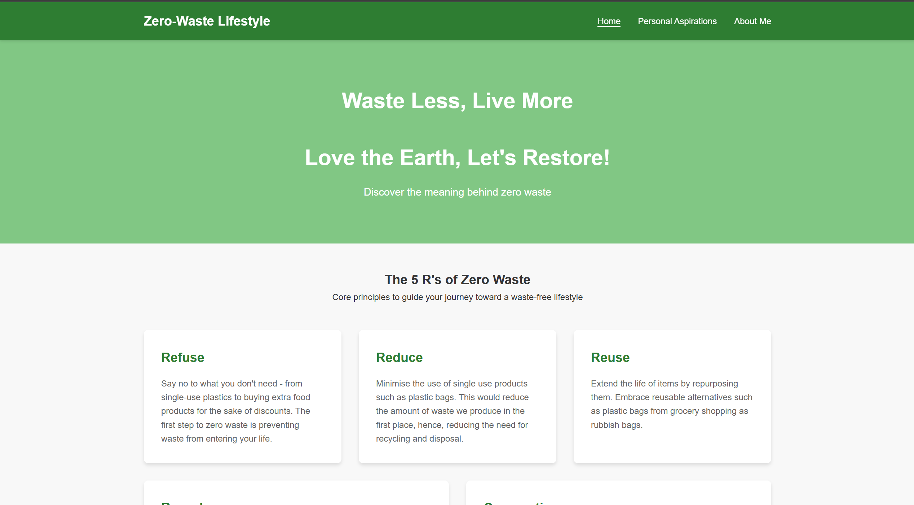

# Zero-Waste Lifestyle Website

A static website promoting zero-waste living, built for enhancing skills in front-end development.

**Live demo:** https://scriver0639.github.io/zero-waste-website/htmlFiles/index.html

**Homepage screenshot:**\
You should see this page when you click the link above
)

## What I focused on

- Using **CSS Grid** to build unusual box layouts, and seeing how layout
  choices affect readability.
- Building a **multi-page site** with working navigation between separate
  HTML files, rather than one long single page.

## Pages

- `index.html` — home
- `about.html` — about zero-waste living
- `tips.html` — practical tips

## How to run it

1. Clone the repo:

```bash
   git clone https://github.com/yourusername/zero-waste-website.git
```

2. Keep the folder structure as-is — the pages link to `images/` and
   `css/` using relative paths.
3. Open `index.html` in any browser.